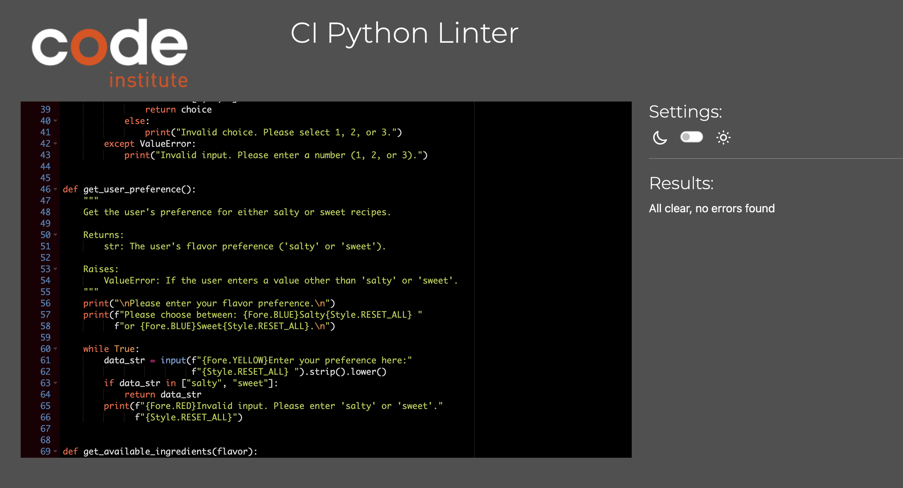

# Recipe Finder LoCo

<p align="center">
    
</p>

## Introduction

Welcome to my third project, part of the Code Institute Full Stack Development Course. The purpose of this project is to build a responsive website using Python.

Recipe Finder LoCo is meant for those seeking to "Look less and Cook more". A convenient and easy-to-use tool designed to help users discover new meal ideas based on common ingredients typically found at home. Users can either find a recipe or contribute by adding their own recipes to help others.

## Strategy

How often do we come home from a long day, open the fridge, and find ourselves staring at its contents without any idea of what to cook? Recipe Finder LoCo is designed to help those moments disappear by letting users quickly choose ingredients and discover delicious recipes, making meal decisions easy and enjoyable.

## UX - User Experience Design

The 5 planes of UX are the following:

* The Strategy Plane
* The Scope Plane
* The Structure Plane
* The Skeleton Plane
* The Surface Plane

### The Strategy Plane

1. As the owner

* I want to show a greeting message and display a menu with the available options.

* If the user chooses to find a recipe, I want to help them decide by selecting between salty or sweet recipes.

* I want the user to easily see the list of ingredients they can choose from and display recipes based on their selection.

* I want to provide error messages for incorrect input and allow users to try again.

* I want to let users search for other recipes with different ingredients.

* I want to allow users to exit or return to the main menu.

* I want the user to feel engaged by allowing to contribute by adding their own recipes.

2. As a customer

* I want a tool that allows me to explore and find new recipes in an easy and straightforward way.

* I want to see all available recipes containing the selected ingredient, along with the remaining ingredients needed.

* If given the option to add my own recipe, I want the process to be simple and the instructions easy to follow.

### The scope

Below is a list of the leading features for the application.

#### In Scope Features

* A welcome message.

* Option to find a recipe:
  * Option to choose recipes based on flavor preference (salty or sweet).
  * Option to select ingredients from a list.
  * Option to repeat the process to find new recipes or return to the main menu.

* Option to add new recipe.
  * Add the recipe to the spreadsheet, including flavor profile and list of ingredients.

#### Out of Scope Features that could be implemented in the future

* Extend the list of recipes available.

* Include more flavour profiles or dietary restrictions.

* Add new categories such as cuisines, seasonal recipes, etc.

* Add cooking instructions for each recipe for the user to understand how to make their chosen recipe.

### Structure

The website will be structured with the following design considerations.

* The user will be greeted by a welcome message in the CLI (Command Line Interface).
* A menu will be displayed, prompting the user to choose an option.
* If the user chooses to find a recipe:
  * They will select a flavor preference (salty or sweet).
  * A list of relevant ingredients will be displayed for selection.
  * Recipes containing the chosen ingredient will be shown, along with any remaining ingredients needed.
  * The user will be asked if they want to search for another recipe or return to the main menu.
* If the user chooses to add a new recipe:
  * They will be prompted to enter the recipe name, flavor profile, and list of ingredients.
  * A confirmation message will be displayed, thanking them for their contribution.
* If the user opts to exit, they will receive a goodbye message.

### Skeleton

The interface is designed to be simple and clean for an optimal user experience. Key features include:

* Minimal inputs for seamless navigation.
* A clean aesthetic with basic colors (yellow, blue, green, red) to highlight important information.
* User-friendly error messages that guide users to correct mistakes.

#### Flowchart

A flowchart outlining the customer journey has been created using Lucidchart. The final application may contain higher level of detail.

<p align="center">
    
</p>

### Surface

The surface theme has been kept simple and clean for a better user experience.

#### Colour and font

For colour and font colorama was imported into the pipeline for accents of colour throughout the code in order to make easier for the user to follow important information. Yellow, blue, green and red are the only colors chosen. 

Fore style was chosen due to its easy legibility. None of these have been overly used to ensure all critical text is readable.

### Features

### Current Features

* A welcome message greets the customer.

<p align="center">
    
</p>

* When option 1 is chosen flavour prefence shows up where the user must choose between salty or sweet.

<p align="center">
    
</p>

* Ingredient lists are displayed based on the flavor preference.

<p align="center">
    
</p>

* The user will pick an ingredient and a list of recipes containing that ingredients will show up. Recipes will also show the remaining ingredients to make the recipe.

<p align="center">
    
</p>

* The user will then be asked if they wish to find more recipes by adding a new ingredient. If "yes" the list of ingredients will appear again.

<p align="center">
    
</p>

* If "no" the user will return to the main menu.

<p align="center">
    
</p>

* When option 2 is chosen the user will be asked to enter the name of the recipe, alongside their flavour profile (salty/sweet), and list of ingredients.

<p align="center">
    
</p>

* The user will then receive a thank you message.

<p align="center">
    
</p>

* The receipe will be saved to the googlesheet.

<p align="center">
    
</p>

* The program uses gspread API to interact with googlesheets where the ingredients and flavour profile for each recipe is stored.

<p align="center">
    
</p>

* When option 3 is chosen the user will be asked if the wish to return to the main menu or exit. This is to allow the user to rectify a possible mistake by having clicked option 3 by mistake. If they do decide to leave a goodbye message will be shown.

<p align="center">
    
</p>

* Invalid input prompts are displayed across the code to guide the user has made a mistake.

<p align="center">
    
</p>


### Future Features

The application can be further developed. Some features include the following:

* Add cooking instructions for each recipe.
* Add an estimate cooking time for each recipe.
* Add quantities to each ingredient to show how much it is needed per person.
* Add calorie count to each ingredient to calculate the calories or nutritional content on each recipe.

### Testing

#### Validator testing

* Python

No major issues found when run through Code Institute's PEP8 linter.

<p align="center">
    
</p>

Validator Testing
Python
No major issues found when run through a PEP8 linter. Code Institute's PEP8 linter.

#### Manual testing

<p align="center">
    
</p>

### Fixed Bugs

* During the project, no major bugs were encountered.
* However, there was an issue when the computer broke down mid-project. A new workspace was set up on a friend's computer, but new commits were not being saved properly. After troubleshooting with tutors and trying to pull the commits, further errors occurred.
* This issue was resolved with the help of the mentor, who suggested saving the current code directly into run.py from GitHub.

### Unfixed

No unfixed bugs that I am aware of.

### Deployment

#### Create googlesheet and integrate using an API

<details>
    <summary></summary>

Create a googlesheet
1. Login to your Google account, create an account if necessary.
1. Navigate to Sheets, Googles version of Microsoft Excel.
1. Start a new spreadsheet,


Setup API
1. Navigate to Google cloud platform.
1. If you do not already have a profile then follow the basic steps for creating an Account, via clicking on the 'Get Started for Free' button in the upper right corner.
1. Once the previous step is complete, create a new project with a unique title
1. You should now arrive at the project dashboard and be ready to setup the required credentials:
    * Access the navigation menu from clicking on the hamburger button
    * Select APIs and Services, followed by 'Library'
    * Search for and select Google Drive API -> Enable
    * Search for and select Google Sheets API -> Enable
    * Click Enable to navigate to 'API and Services Overview' 
    * Click Create Credentials in the upper left of the screen
    * For Credential Type, select 'Google Drive' from the dropdown
    * For 'What data will you be accessing' select Application Data
    * For 'Are you planning to use this API with Compute Engine...?' choose 'No, I'm not...'
    * Click Next
    * Within the Create Service Account page, enter a Service Account Name
    * Click Create and Continue
    * Next within 'Grant this service account access to project', choose Basic -> Editor from the 'Select a Role' dropdown
    * Click Continue
    * Next within 'Grant users access to this service account', choose 'Done'
    * On the following, click on the 'Service Account Name' you created to navigate to the config page
    * Navigate to the Keys section
    * Select 'Add Key' dropdown -> Create New Key.
    * Select 'JSON' -> Create - the file will download to your machine
    * From your local downloads folder, add file directly to your Gitpod workspace, and rename the file to creds.json
    * Within the file, copy the value for 'client email'. Paste this email address into the 'Share' area of your Google Sheet, assigning the role of Editor

Enable API within IDE
1. From within your GitPod IDE terminal, enter 'pip3 install gspread google-auth'
1. At the top of your Python file add the following lines:

    ```
    import gspread
    from google.oauth2.service_account import Credentials
    ```
    
1. Below this add the following code:

    ```
        SCOPE = [
            "https://www.googleapis.com/auth/spreadsheets",
            "https://www.googleapis.com/auth/drive.file",
            "https://www.googleapis.com/auth/drive"
            ]

        CREDS = Credentials.from_service_account_file('creds.json')
        SCOPED_CREDS = CREDS.with_scopes(SCOPE)
        GSPREAD_CLIENT = gspread.authorize(SCOPED_CREDS)
        SHEET = GSPREAD_CLIENT.open('vv_pizzas')
        console = Console()
        install(show_locals=True)
    ```
</details>

#### Deploy with Heroku
<details>
    <summary></summary>

* The requirements.txt file in the IDE must be updated to package all dependencies. To do this:
    1. Enter the following into the terminal: 'pip3 freeze > requirements.txt'
    1. Commit the changes and push to GitHub

* Next, follow the steps below:
    1. Login to Heroku, create an account if necessary
    1. Once at your Dashboard, click 'Create New App'
    1. Enter a name for your application, this must be unique, and select a region
    1. Click 'Create App'
    1. At the Application Configuration page, apply the following to the Settings and Deploy sections:
        * Within 'Settings', scroll down to the Config Vars section to apply the credentials being used by the application. In the Reveal Config Vars enter 'CREDS' for the Key field and paste the all the contents from the creds.json file into the Value field
        * Click 'Add'
        * Add another Config Var with the Key of 'PORT' and the Value of '8000'
        * Within Settings, scroll down to the Buildpacks sections, click to Add a Buildpack
        * Select Python from the pop-up window and Save
        * Add the Node.js Buildpack using the same method
        * Navigate to the Deploy section, select Github as the deployment method, and connect to GitHub when prompted
        * Use your GitHub repository name created for this project
        * Finally, scroll down to and select to deploy 'Automatically' as this will ensure each time you push code in GitHub, the pages through Heroku are updated
    1. Your application can be run from the Application Configuration section, click 'Open App'

</details>

***

### Credits

* Mentorship

Special thanks to my mentor Brian Macharia for his incredible support and guidance on improving the code and user experience.

* Inspiration

  * Inspiration for building a recipe finder:
https://www.makeuseof.com/recipe-finder-app-python/

  * Flowcharts and Google Sheet organization:
    * https://github.com/RickofManc/vv-pizzas
    * https://github.com/alexkavanagh-dev/grocery_list_generator

  * Deployment information was sourced from:
https://github.com/RickofManc/vv-pizzas

### Python libraries, software and web application

* Google Sheets - Display recipes, flavor profiles, and ingredients.
  * [Google Sheet](https://docs.google.com/spreadsheets/d/1QEgz7x3UKXEElsaPsE19S-WLulp7T6IgYADYWpCqXQU/edit?pli=1&gid=2115059317#gid=2115059317)

* Colorama - Display colors for better visibility.
  * [Colorama](https://pypi.org/project/colorama/)

* Lucidchart - Create flowcharts.
  * [Lucidchart](https://www.lucidchart.com/pages/)

* Learning Resources:
  * [W3schools](https://www.w3schools.com/)
  * [ChatGPT](https://chatgpt.com)

* Code Testing:
  * [Python Tutor](https://pythontutor.com/)

* Python Validation:
  * [PEP8 Validator](http://pep8online.com/)


